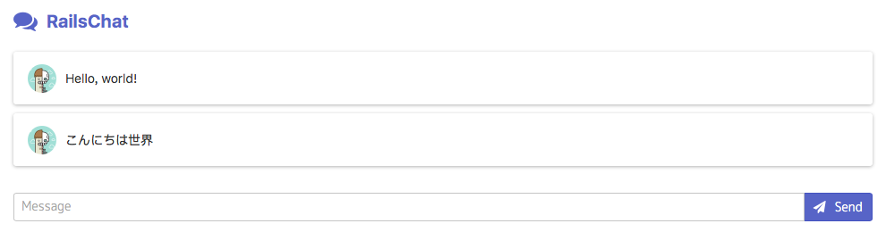

# Simple Chat application



## Getting started

1. Clone sample apps

   ``` shell
   $ git clone https://github.com/cloud-hackathon/ruby-apps.git
   ```

2. Move to `rails-chat` directory
3. Run application

   ``` shell
   $ docker-compose up
   ```
   
4. Access `<host address>:8080` on browser

## Reference

* [Spectre.css](https://picturepan2.github.io/spectre/)
* [Font Awesome](http://fontawesome.io)
